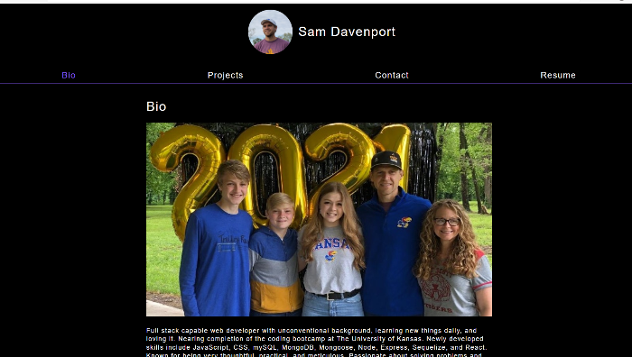

# myPortfolio   

Full stack app created with React.js and MongoDB in order to showcase some of my web development work and provide a short bio.

## Table of Contents
* [Description](#description)
* [View](#view)
* [License](#license)
* [References](#reference)
* [Contributing](#contributing)
* [Tests](#tests)
* [Questions](#questions)

## Description 
_***Built With:***_ JavaScript,HTML,CSS,ES6,Node,Express,MongoDB,React  
This is my professional portfolio site. It is a full stack MERN project. It was created using create-react-app. It is a Single page application which  uses the react-router npm package to change the view without rerendering the page. It uses MongoDB and Mongoose ORM along with graphql to collect contact info data. It has an Express server and uses Node.js. It lists biographical info, featured projects, a contact form, and my skills and resume. It links to my gitHub profile, linkedIn profile, and codeCademy profile.

## View 

[Visit the deployed site](https://secret-savannah-35789.herokuapp.com/)

## License 
[MIT](./LICENSE)

## References 
None

## Contributing 
N/A

## Tests 
N/A at this time

## Questions 
Contact: Sam Davenport  
https://github.com/steadysamwise4  
davenportsam44@gmail.com
    
